<h1>Zenoh Face Recognition On Raspberry Pi</h1>
<p>This project implements a face recognition algorithm into Zenoh router(edge computing) using LBPH algorithm for the recognition part and Viola Jones for the detection part. For more information about these algorithms, please refer to <a href="https://github.com/Harmouch101/Face-Recogntion-Detection">this repo</a>.
</p>
<h2>Zenoh API on Raspberry Pi model b+</h2>	
<p>At the moment of building this project, the Zenoh API is only compatible with a specific versions of Raspian(Raspbian-9.4-armv7l) which can be downlaoded using <a href="https://downloads.raspberrypi.org/raspbian_full/images/raspbian_full-2019-09-30/">this link</a>
</p>
<h2>Writing The Raspian image to a microSD card</h2>	
<ol>
	<li> Connect the SD card to your PC.</li>
	<li> Format your memory card. For example, on windows, simply right click on the sd card icon and click format.</li>
	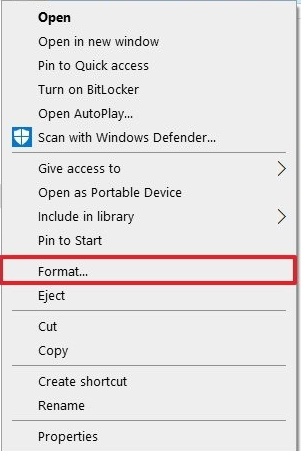
	<li> Unpack the downloaded ZIP archive, downloaded previously, to any location on your computer.</li>
	<li> Download and install <a href="https://github.com/pbatard/rufus">Rufus</a> utility to write images to microSD on your computer.</li>
	<li> Run the Rufus program and write raspian image on the sd card.</li>
	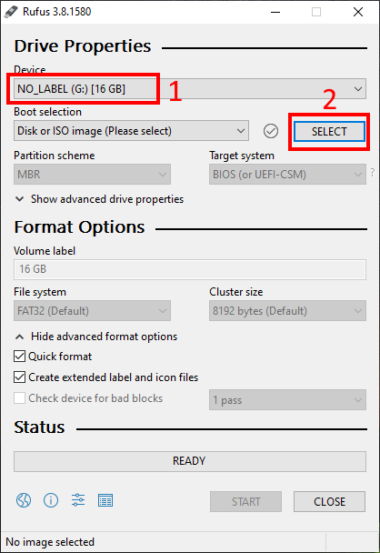
	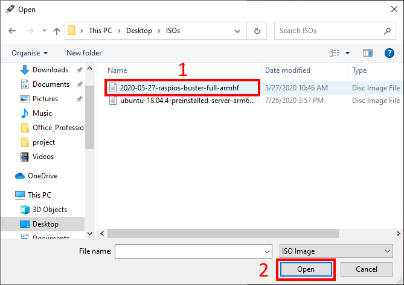
	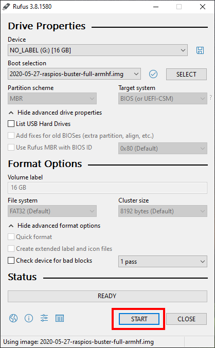
</ol>
<h2>Install Zenoh on Raspian OS</h2>	
<p> Once the Raspberry Pi is up and running, click the following <a href="https://download.eclipse.org/zenoh/zenoh/0.4.2-M1/eclipse-zenoh-0.4.2-M1-Raspbian-9.4-armv7l.tgz">link</a> to download the zenohd executable file.</p>
<ul> 
	<li> Unpack the archived file in a given directory.</li>
	<li> Open the folder(bin folder) thatcontains the executable file zenohd.exe.</li>
	<li> Open your terminal and enter the following command :</li>
</ul>

```bash
$ ./zenohd.exe -v -p tcp/192.168.1.8:7447	# 192.168.1.8 is the ip address of the other peer(pc).
```
<p> This will run zenoh daemon on your raspberry and connect to the "192.168.1.8" peer, which, by default, is listening on port 7447 for zenoh communication. The raspberry will play the role of a client, and on another pc, there is a zenoh server.</p>
<h2>Install Zenoh on a Linux distro(ubuntu in my case)</h2>
<p> For the sake of simplicity, zenoh is available in a docker image which we will use it in our project. So first make sure that <a href="https://docs.docker.com/engine/install/ubuntu/">docker</a> is available on your machine by executing the following command:</p>

```bash
$ docker --version
```
<p> If it is installed, your terminal should output the Docker version number. As described in this <a href="https://github.com/Harmouch101/zenoh">repo</a>, you can install the docker image of zenoh using the following command :</p>

```bash
$ docker pull eclipse/zenoh:latest
```
<p> This pulls the zenoh image/repo from the registry to your local machine. In order to verify that the image is locally stored with the docker engine, you need to run the following command:</p>

```bash
$ docker image ls      # or $ docker images
```
<p> Which will output the following if the image is successfully stored on your local machine :</p>

```
 REPOSITORY          TAG                 IMAGE ID            CREATED             SIZE
 eclipse/zenoh       latest              a2056fe06164        7 weeks ago         238MB
```
<p> In the beginning, there are no containers on the machine:</p>

```bash
$ docker ps 
```
```
 CONTAINER ID     IMAGE     COMMAND     CREATED     STATUS     PORTS     NAMES
```
<p> To create a container associated with the name <b>zenoh</b>, you need to run the following :</p>

```bash
$ sudo docker create -t -i eclipse/zenoh --name zenoh    
```

```
 CONTAINER ID           IMAGE               COMMAND           CREATED     STATUS          PORTS      NAMES
 ad40926fcae0     eclipse/zenoh:latest  "/entrypoint.sh -v"  3 hours ago  Exited (137) 3h  			 zenoh
```
<p> You could also rename the container using the following command :</p>

```bash
$ docker rename zenoh zenoh1  
```

```
 CONTAINER ID           IMAGE               COMMAND           CREATED     STATUS          PORTS      NAMES
 ad40926fcae0     eclipse/zenoh:latest  /entrypoint.sh -v  3 hours ago  Exited (137) 3h 			zenoh1
```
<p> To start the container, execute the following :</p>

```bash
$ docker start -i ad40926fcae0
```

```
 * Starting database influxd                                             [ OK ] 
 * Starting: /eclipse-zenoh/bin/zenohd.exe -v
[1597070149.524708][INFO] Running scouting on interface auto
[1597070149.524863][INFO] Joining MCast group
[1597070149.525432][INFO] Zenoh router starting ...
[1597070149.525679][INFO] pid     : c53f541f83c3402080061843287bee3f
[1597070149.525703][INFO] tcpport : 7447
[1597070149.525868][INFO] peers   : 
[1597070149.529727][INFO] Loading plugin 'storages' from '/eclipse-zenoh/bin/../lib/zenoh-plugin-storages.cmxs' with args: '/eclipse-zenoh/bin/../lib/zenoh-plugin-storages.cmxs'...
[1597070149.535750][INFO] [Zstorages] create storages admin space on /@/router/c53f541f83c3402080061843287bee3f/plugin/storages/**
[1597070149.536005][INFO] Loading plugin 'http' from '/eclipse-zenoh/bin/../lib/zenoh-plugin-http.cmxs' with args: '/eclipse-zenoh/bin/../lib/zenoh-plugin-http.cmxs'...
[1597070149.538216][INFO] [Zhttp] listening on port tcp/0.0.0.0:8000
[1597070149.538276][INFO] TcpService listening on port tcp/0.0.0.0:7447
```
<p> To stop the container, open a new terminal and execute the following :</p>

```bash
$ docker stop ad40926fcae0
```
<p> Or you could run the docker image <b>eclipse/zenoh</b> using the following :</p>

```bash
$ docker run --init -p 7447:7447/tcp -p 7447:7447/udp -p 8000:8000/tcp eclipse/zenoh -v
```
<p> You could also specify the peer, which is in this case, the IP address of the raspberry :</p>

```bash
$ docker run --init -p 7447:7447/tcp -p 7447:7447/udp -p 8000:8000/tcp eclipse/zenoh -v -p tcp/192.168.1.4:7447
```
```
 * Starting database influxd
   ...done.
 * Starting: /eclipse-zenoh/bin/zenohd.exe -v -p tcp/192.168.1.4:7447
[1597070521.551351][INFO] Running scouting on interface auto
[1597070521.551439][INFO] Joining MCast group
[1597070521.551545][INFO] Zenoh router starting ...
[1597070521.551617][INFO] pid     : 46fdc400add84fbdb6ef2d657c92225b
[1597070521.551638][INFO] tcpport : 7447
[1597070521.551683][INFO] peers   : tcp/192.168.1.4:7447
[1597070521.555658][INFO] Loading plugin 'storages' from '/eclipse-zenoh/bin/../lib/zenoh-plugin-storages.cmxs' with args: '/eclipse-zenoh/bin/../lib/zenoh-plugin-storages.cmxs'...
[1597070521.562194][INFO] [Zstorages] create storages admin space on /@/router/46fdc400add84fbdb6ef2d657c92225b/plugin/storages/**
[1597070521.562450][INFO] Loading plugin 'http' from '/eclipse-zenoh/bin/../lib/zenoh-plugin-http.cmxs' with args: '/eclipse-zenoh/bin/../lib/zenoh-plugin-http.cmxs'...
[1597070521.564825][INFO] [Zhttp] listening on port tcp/0.0.0.0:8000
[1597070521.565046][INFO] TcpService listening on port tcp/0.0.0.0:7447
```
<p> To stop the running container, simply press <b>ctrl + c</b> , this is because of --init option which sets <b>ENTRYPOINT</b> to <b>tini</b> and passes the <b>CMD</b> to it.</p>
<p> This machine will play the role of a server for face recognition.</p>
<h2>Face Recognition Server Side</h2>
<p> This project consists of two processes: client and server. The server will train the model for further face recognition, and The client sends, periodically, frames from a webcam or pre-recorded video to storage_1 predefined into zenoh router. The training part is shown in the flowchart below.</p>
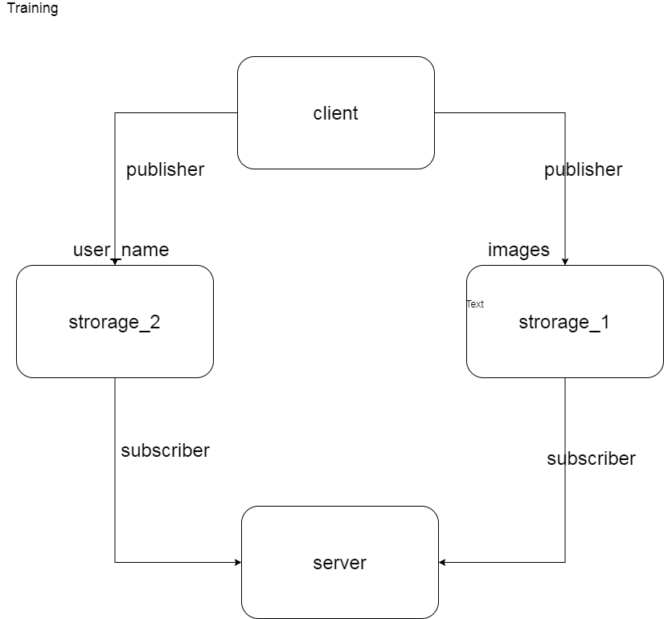
<p> The server receives images to train the model. If the number of images captured for a face a greater than 50, it will signal the client to stop sending samples(frames). The following illustration is a flowchart for the train_server.py script</p>
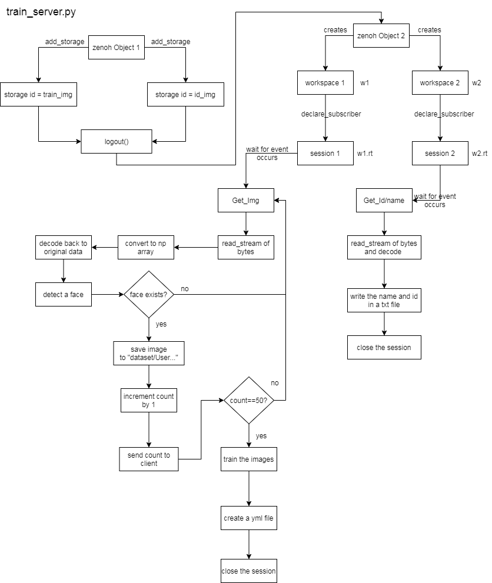
<p> To run the server script, you need to build the zenoh-python API from <a href="https://github.com/Harmouch101/zenoh-python">this repo</a>. you can install it by using the following command:</p>

```bash
$ pip3 install eclipse-zenoh
```
<p> Now you need to clone this repo on your local machine :</p>

```bash
$ git clone https://github.com/Harmouch101/zenoh-python
```
<p> Copy the files available in the server folder of the current repo after cloning it.</p>

```bash
$ git clone https://github.com/Harmouch101/Zenoh-Face-Recognition
```
<p> At this point, you can execute the following command to train the model:</p>

```bash
$ python3 train_server.py
```
```
* WARNING : libzenohc.so not found along with zenoh python installation (not present in the wheel?). Try to load it from /usr/local/lib
Creating a Zenoh object(locator=tcp/127.0.0.1:7447)...
Adding storage with id train_img and selector /Face/Recognition/train_image/** 
Adding storage with id id_img and selector /Face/Recognition/id_image/** 
peer id = bc96b368a5764a5ca4e35512f420ef67
Creating a Zenoh object(locator=tcp/127.0.0.1:7447)...
Use Workspace on "/Face/Recognition/train_image/" to get an image
Use Workspace on "/Face/Recognition/id_image/" get a name
Declaring Subscriber on '/Face/Recognition/train_image/**'...
Declaring Subscriber on '/Face/Recognition/id_image/**'...
```
<h2>Face Recognition Client Side (Raspberry Pi)</h2>
<p> On Raspberry pi, make sure that you have <i>git</i> and clone the zenoh-python API repo and this current repo: </p>

```bash
$ git clone https://github.com/Harmouch101/zenoh-python
$ git clone https://github.com/Harmouch101/Zenoh-Face-Recognition
```
<p> Copy the files available in the client folder into the zenoh-python folder.</p>
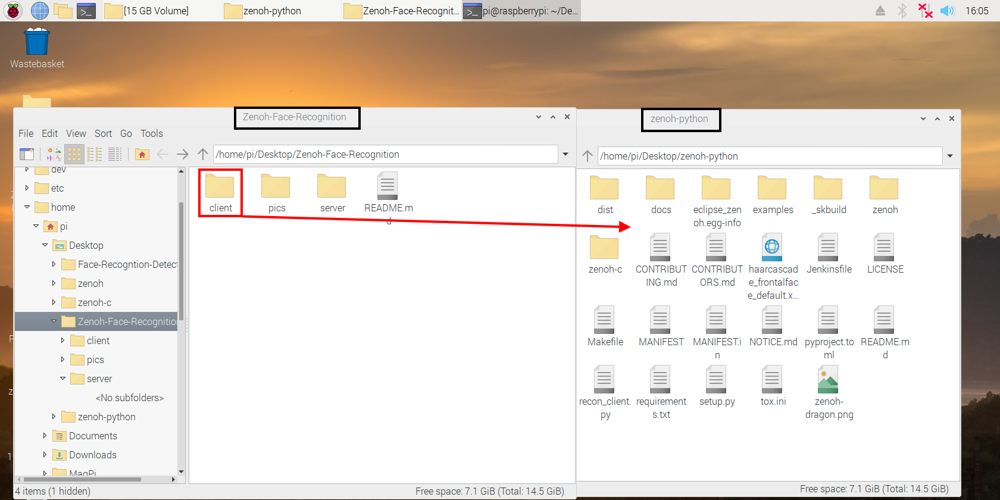
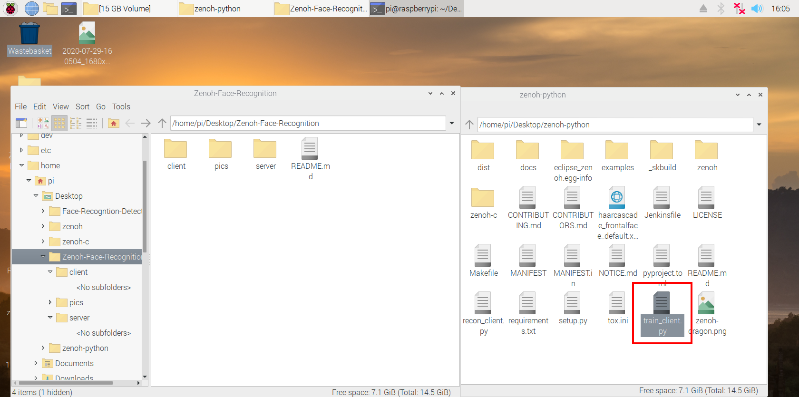
<p> Then install the OpenCV library on the raspberry using the following command: </p> 

```bash
$ pip3 install opencv-contrib-python; sudo apt-get install -y libatlas-base-dev libhdf5-dev libhdf5-serial-dev libatlas-base-dev libjasper-dev  libqtgui4  libqt4-test
```
<p> Now you need to install zenoh library:</p>

```bash
$ pip3 install eclipse-zenoh
```
<p> At this point, you can execute the following command to train the model:</p>

```bash
$ python3 train_client.py -c 0			# id of the webcam or
$ python3 train_client.py -v video_path			# pre-recorded video
```
<p> The program will ask you to provide the name of the person to train the model: </p>

```
* WARNING : libzenohc.so not found along with zenoh python installation (not present in the wheel?). Try to load it from /usr/local/lib
Creating a Zenoh object(locator=tcp/127.0.0.1:7447)...
Use Workspace on "/Face/Recognition/train_image/" to send training images
Use Workspace on "/Face/Recognition/id_image/" to send id

 Enter the user name and press <return> ==> 
```
<p> After that, the client starts sending frames to the server which will take those pictures and train a model for further recognition purposes. The server will prompt the following:</p>

```
Name Stored in 1

 [INFO] Face training, wait ...

 [INFO] 1 persons trained. Exiting the program 

 [INFO] Quitting the program
```
<p> The image below is the flowchart of the logic of this script:</p>
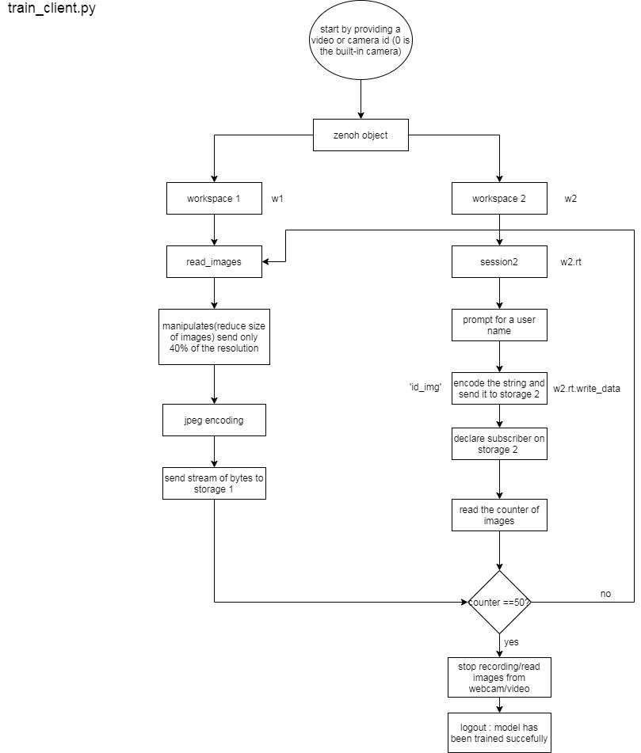

<h2>Face Recogition<h2>
<p> After building a model on the trained samples, you can now start recognizing faces by running the following scripts: </p>

```bash
$ python3 rec_server.py 			# At the server side
$ python3 rec_client.py -c 0 			# At the client side(raspberry)
```
<p> The raspberry pi will start capturing images from the camera and send it to the server in order to recognize the face available in the pictures and returned back to the client.</p>

<h2>Testing Network Performance</h2>
<p> In this section, we will measure the network performance such as transmission rate and network delay between the two peers(Raspberry pi and PC): client and server. The <b>rec_client.py</b> script will generate two files <b>rate.txt</b> and <b>delay.txt</b>. Each file contains a time series for the previous parameters(rate and delay). I have used the <b>Plotly</b> library for plotting purposes. Open the <b>plot.ipynb</b> in jupyter notebook interface. The notebook is available under the <b>client</b> folder.</p>

```bash
$ jupyter notebook
```
<h3>Delay Plot</h3>
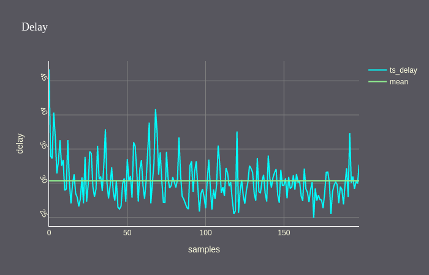
<h3>Transmission Rate Plot</h3>
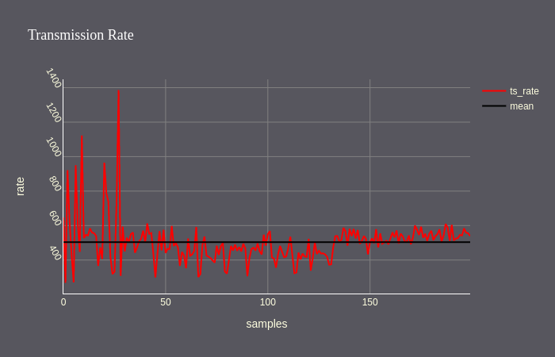