<h1>Computer Vision Automated Control System With Zenoh</h1>
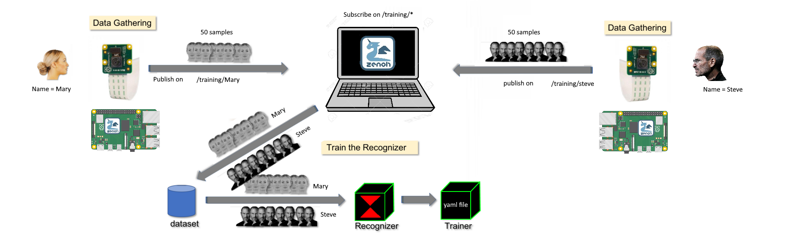
<p> This project is a computer vision system control based on Zenoh pub/Sub architecture. the machine learning algorithms used in this project are: the Viola-Jones algorithm for face detection and the local binary pattern histograms(LBPH) for face recognition. For more information about these algorithms, please refer to <a href="https://github.com/Harmouch101/Face-Recogntion-Detection">this repo</a>.
</p>
<h2>Zenoh API on Raspberry Pi model b+</h2>	
<p> To implement the main control system, you need to have at least 2 raspberry pi 3 model b+ and a raspberry py camera model V2. At the moment of building this project, the Zenoh API is only compatible with a specific version of Raspian(Raspbian-9.4-armv7l) which can be downloaded using <a href="https://downloads.raspberrypi.org/raspbian_full/images/raspbian_full-2019-09-30/">this link</a>
</p>
<h2>Writing The Raspian image to a microSD card</h2>	
<ol>
	<li> Connect the SD card to your PC.</li>
	<li> Format your memory card. For example, on windows, simply right click on the sd card icon and click format.</li>
	
	<li> Unpack the downloaded ZIP archive, downloaded previously, to any location on your computer.</li>
	<li> Download and install <a href="https://github.com/pbatard/rufus">Rufus</a> utility to write images to microSD on your computer.</li>
	<li> Run the Rufus program and write raspian image on the sd card.</li>
	
	
	
</ol>
<h2>Install Zenoh on Raspian OS</h2>
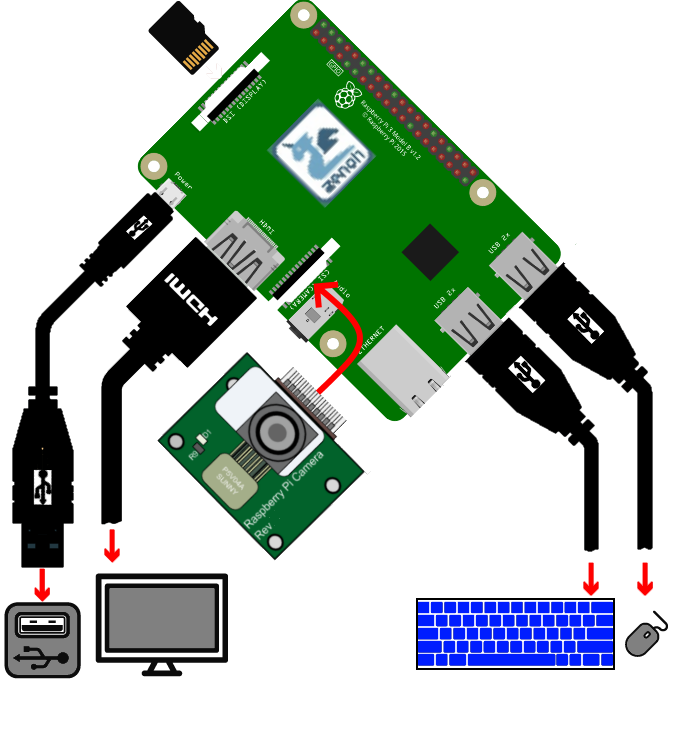
<p> Once the Raspberry Pi is up and running, click the following <a href="https://download.eclipse.org/zenoh/zenoh/0.4.2-M1/eclipse-zenoh-0.4.2-M1-Raspbian-9.4-armv7l.tgz">link</a> to download the zenohd executable file.</p>
<ul> 
	<li> Unpack the archived file in a given directory.</li>
	<li> Open the folder(bin folder) that contains the executable file zenohd.exe.</li>
	<li> Open your terminal and enter the following command :</li>
</ul>

```bash
$ ./zenohd.exe -v -p tcp/192.168.1.8:7447	# 192.168.1.8 is the ip address of the other peer(pc).
```
<p> This will run zenoh daemon on your raspberry and connect to the "192.168.1.8" peer, which, by default, is listening on port 7447 for zenoh communication. One raspberry will play the role of a zenoh client, and on another raspberry(or a pc if you don't want to implement the control system), there is a zenoh server.</p>
<h2> Part One : Using a PC, with ubuntu desktop distro, to configure it as a zenoh server</h2>
<p> For the sake of simplicity, zenoh is available in a docker image which we will use it in our project. So first make sure that <a href="https://docs.docker.com/engine/install/ubuntu/">docker</a> is available on your machine by executing the following command:</p>

```bash
$ docker --version
```
<p> If it is installed, your terminal should output the Docker version number. As described in this <a href="https://github.com/Harmouch101/zenoh">repo</a>, you can install the docker image of zenoh using the following command :</p>

```bash
$ docker pull eclipse/zenoh:latest
```
<p> This pulls the zenoh image/repo from the registry to your local machine. In order to verify that the image is locally stored with the docker engine, you need to run the following command:</p>

```bash
$ docker image ls      # or $ docker images
```
<p> Which will output the following if the image is successfully stored on your local machine :</p>

```
 REPOSITORY          TAG                 IMAGE ID            CREATED             SIZE
 eclipse/zenoh       latest              a2056fe06164        7 weeks ago         238MB
```
<p> In the beginning, there are no containers on the machine:</p>

```bash
$ docker ps 
```
```
 CONTAINER ID     IMAGE     COMMAND     CREATED     STATUS     PORTS     NAMES
```
<p> To create a container associated with the name <b>zenoh</b>, you need to run the following :</p>

```bash
$ sudo docker create -t -i eclipse/zenoh --name zenoh    
```

```
 CONTAINER ID           IMAGE               COMMAND           CREATED     STATUS          PORTS      NAMES
 ad40926fcae0     eclipse/zenoh:latest  "/entrypoint.sh -v"  3 hours ago  Exited (137) 3h  			 zenoh
```
<p> You could also rename the container using the following command :</p>

```bash
$ docker rename zenoh zenoh1  
```

```
 CONTAINER ID           IMAGE               COMMAND           CREATED     STATUS          PORTS      NAMES
 ad40926fcae0     eclipse/zenoh:latest  /entrypoint.sh -v  3 hours ago  Exited (137) 3h 			zenoh1
```
<p> To start the container, execute the following :</p>

```bash
$ docker start -i ad40926fcae0
```

```
 * Starting database influxd                                             [ OK ] 
 * Starting: /eclipse-zenoh/bin/zenohd.exe -v
[1597070149.524708][INFO] Running scouting on interface auto
[1597070149.524863][INFO] Joining MCast group
[1597070149.525432][INFO] Zenoh router starting ...
[1597070149.525679][INFO] pid     : c53f541f83c3402080061843287bee3f
[1597070149.525703][INFO] tcpport : 7447
[1597070149.525868][INFO] peers   : 
[1597070149.529727][INFO] Loading plugin 'storages' from '/eclipse-zenoh/bin/../lib/zenoh-plugin-storages.cmxs' with args: '/eclipse-zenoh/bin/../lib/zenoh-plugin-storages.cmxs'...
[1597070149.535750][INFO] [Zstorages] create storages admin space on /@/router/c53f541f83c3402080061843287bee3f/plugin/storages/**
[1597070149.536005][INFO] Loading plugin 'http' from '/eclipse-zenoh/bin/../lib/zenoh-plugin-http.cmxs' with args: '/eclipse-zenoh/bin/../lib/zenoh-plugin-http.cmxs'...
[1597070149.538216][INFO] [Zhttp] listening on port tcp/0.0.0.0:8000
[1597070149.538276][INFO] TcpService listening on port tcp/0.0.0.0:7447
```
<p> To stop the container, open a new terminal and execute the following :</p>

```bash
$ docker stop ad40926fcae0
```
<p> Or you could run the docker image <b>eclipse/zenoh</b> using the following :</p>

```bash
$ docker run --init -p 7447:7447/tcp -p 7447:7447/udp -p 8000:8000/tcp eclipse/zenoh -v
```
<p> You could also specify the peer, which is in this case, the IP address of the raspberry :</p>

```bash
$ docker run --init -p 7447:7447/tcp -p 7447:7447/udp -p 8000:8000/tcp eclipse/zenoh -v -p tcp/192.168.1.4:7447
```
```
 * Starting database influxd
   ...done.
 * Starting: /eclipse-zenoh/bin/zenohd.exe -v -p tcp/192.168.1.4:7447
[1597070521.551351][INFO] Running scouting on interface auto
[1597070521.551439][INFO] Joining MCast group
[1597070521.551545][INFO] Zenoh router starting ...
[1597070521.551617][INFO] pid     : 46fdc400add84fbdb6ef2d657c92225b
[1597070521.551638][INFO] tcpport : 7447
[1597070521.551683][INFO] peers   : tcp/192.168.1.4:7447
[1597070521.555658][INFO] Loading plugin 'storages' from '/eclipse-zenoh/bin/../lib/zenoh-plugin-storages.cmxs' with args: '/eclipse-zenoh/bin/../lib/zenoh-plugin-storages.cmxs'...
[1597070521.562194][INFO] [Zstorages] create storages admin space on /@/router/46fdc400add84fbdb6ef2d657c92225b/plugin/storages/**
[1597070521.562450][INFO] Loading plugin 'http' from '/eclipse-zenoh/bin/../lib/zenoh-plugin-http.cmxs' with args: '/eclipse-zenoh/bin/../lib/zenoh-plugin-http.cmxs'...
[1597070521.564825][INFO] [Zhttp] listening on port tcp/0.0.0.0:8000
[1597070521.565046][INFO] TcpService listening on port tcp/0.0.0.0:7447
```
<p> To stop the running container, simply press <b>ctrl + c</b> , this is because of --init option which sets <b>ENTRYPOINT</b> to <b>tini</b> and passes the <b>CMD</b> to it.</p>
<p> This machine will play the role of a server for face recognition.</p>
<h2>Face Recognition Server Side on a PC or laptop</h2>
<p> This project consists of two processes: client and server. The server will train the model for further face recognition, and The client sends, periodically, frames from a webcam or pre-recorded video to '/training/Client_Name'. The training and recognition phases of the server are shown in the flowchart below.</p>
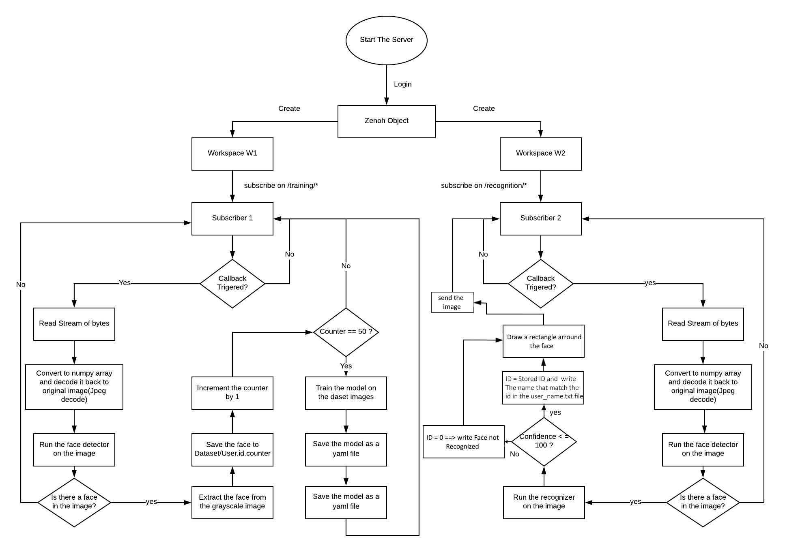
<p> The server receives images on /training/* to train the model. If the number of images captured for a face a greater than 50, the client will stop sending images and the server will start the training phase. The following illustration is a flowchart for the training logic for the client.</p>
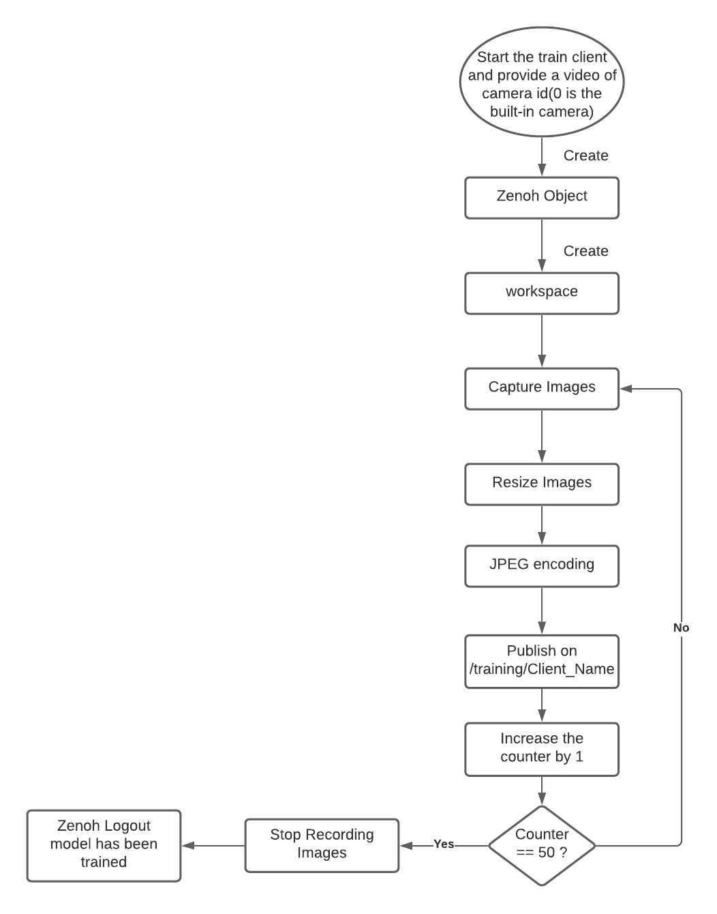
<p> To run the server's script, you need to build the zenoh-python API from <a href="https://github.com/Harmouch101/zenoh-python">this repo</a>. you can install it by using the following command:</p>

```bash
$ pip3 install eclipse-zenoh
```
<p> Now you need to clone this repo on your local machine :</p>

```bash
$ git clone https://github.com/Harmouch101/zenoh-python
```
<p> Copy the file ('zenoh_server_pc.py') available in the server folder of the current repo after cloning it.</p>

```bash
$ git clone https://github.com/Harmouch101/Zenoh-Face-Recognition
```
<p> At this point, you can execute the following command to train the model:</p>

```bash
$ python3 zenoh_server_pc.py
```
```
[*] Please train your model !!!

[*] Creating a Zenoh object(locator=None)

[*] Use Workspace on "/training/" to train the model

[*] Use Workspace on "/recognition/" to recognize images

[*] Declaring Subscriber on '/training/*'...

[*] Declaring Subscriber on '/recognition/*'...

[*] Waiting for a new client to connect...
```
<h2>Face Recognition Client Side (Raspberry Pi)</h2>
<p> On Raspberry pi, make sure that you have <i>git</i> and clone the zenoh-python API repo and this current repo: </p>

```bash
$ git clone https://github.com/Harmouch101/zenoh-python
$ git clone https://github.com/Harmouch101/Zenoh-Face-Recognition
```
<p> Copy the files of the client into the zenoh-python folder.</p>
<p> Then install the OpenCV library on the raspberry using the following command: </p> 

```bash
$ pip3 install opencv-contrib-python; sudo apt-get install -y libatlas-base-dev libhdf5-dev libhdf5-serial-dev libatlas-base-dev libjasper-dev  libqtgui4  libqt4-test
```
<p> Now you need to install zenoh library:</p>

```bash
$ pip3 install eclipse-zenoh
```
<p> At this point, you can execute the following command to train the model:</p>

```bash
$ python3 train_client.py -c 0			# id of the webcam or
$ python3 train_client.py -v video_path			# pre-recorded video
```
<p> The program will ask you to provide the name of the person to train the model: </p>

```
[*] Creating a Zenoh object(locator=None)...

[*] Use Workspace on "/training/" to send training samples

[*] Please enter the user name and press <return> ==>  
```
<p> After that, the client starts sending frames to the server which will take those pictures and train a model for further recognition purposes. The server will prompt the following:</p>

```
[*] Training phase for mahmoud has been started, , please wait a moment...

[*] Creating a training model

[*] 1 Persons has been trained successfully.

[*] Exiting the Training Phase

[*] Waiting for a client to connect...
```
<h2>Face Recogition</h2>
<p> After building a model on the trained samples, the zenoh server is waiting for a connection from clients in order to recognize their images</p>

```bash
$ python3 recognize_client.py -c 0 			# At the client side(raspberry)
```
```
[*] Creating a Zenoh object(locator=None)...

[*] Please enter the camera id and press <return> ==> 1

[*] Sending an image to  /recognition/camera-1

[*] Receiving a recognized image !
```
<p> The program will ask for a unique id for the client, then the raspberry pi will start capturing images from the camera and send it to the server in order to recognize the face available in the pictures and returned back to the client.</p>
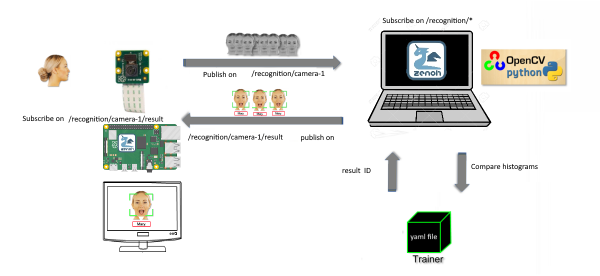
<p> The following image will give you a high overview on the sytem workflow</p>
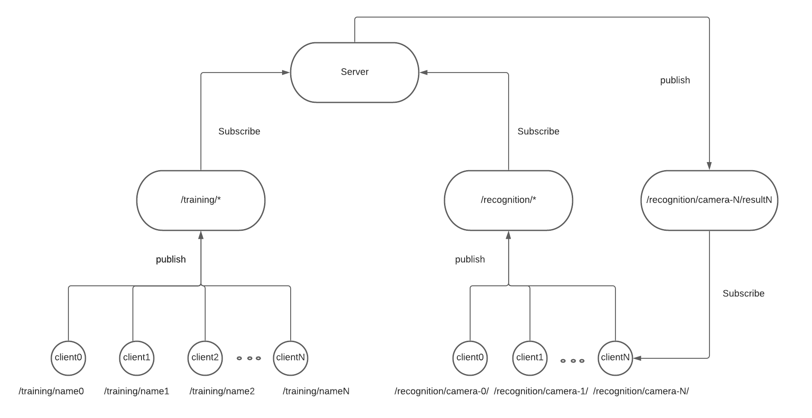
<h2>Testing Network Performance</h2>
<p> Our goal in this task is to measure network communication latency(delay) by using a simple method. We count the time from sending a packet to receive a packet with a response, between the two peers(Raspberry pi and PC): client and server. The <b>recognize_client.py</b> script will generate a pair of files <b>rate.txt</b> and <b>delay.txt</b>. Each file contains a time series for the previous parameters(rate and delay). I have used the <b>Plotly</b> library for plotting purposes. Open the <b>delay_rate.ipynb</b> in jupyter notebook interface. The notebook is available under the <b>client</b> folder.</p>

```bash
$ jupyter notebook
```
<h3>Delay Plot</h3>

<h3>Transmission Rate Plot</h3>

<p> The transmission rate is measured in KB/Sec and the network delay in milliseconds.</p>
<ul>
	<li>Average of trans rate : 500 KB/Sec</li>
	<li>Average of network delay : 30 mSec </li>
</ul>
<h2>Testing Program Performance on the raspberry</h2>
<p> In this section, we will measure the program performance, such as throughput and interprocess communication delay between the two processes: client and server. The <b>recognize_client.py</b> script will generate two files <b>rate1.txt</b> and <b>delay1.txt</b>. Each file contains a time series for the previous parameters(rate and delay). Using the previous notebook, you can generate the following graphs:</p>
<h3>Delay Plot</h3>
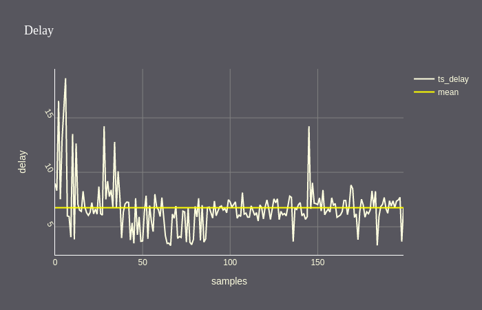
<h3>Transmission Rate Plot</h3>
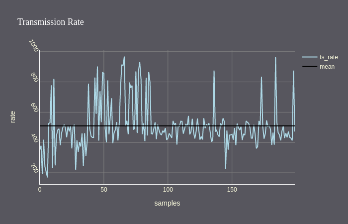
<ul>
	<li>Throughput average : 500 KB/Sec</li>
	<li>Inter-Process communication delay : 7 mSec </li>
</ul>
<p> Now, we can compute the average network delay(transmission + propagation) = 30 - 7 = 23 mSec</p>
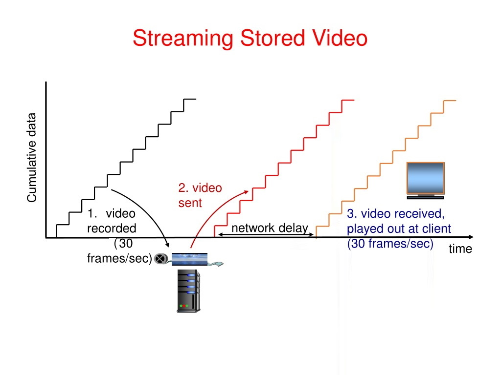
<p> We can also plot the frame rate time series:</p>
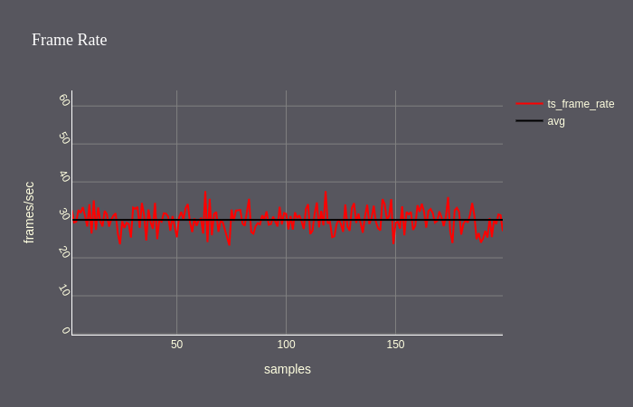
<p> Client playout</p>
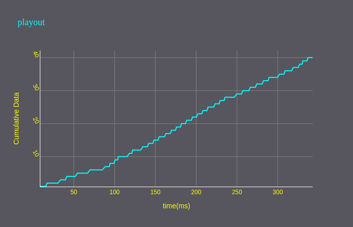
<h2> Part Two : Use another raspberry pi to configure it as a zenoh server</h2>
<p> The figure below shows the train phase of our control vision system built with rasberry pi's that makes a zenoh network</p>
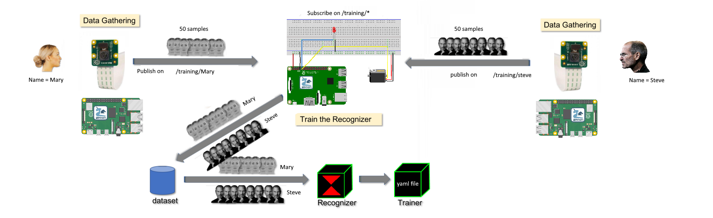
<p> Our control vision system components are: at least Two Raspberry PIs 3 model b+ with are configured in the same way as the part one show. we need also a servo motor and a LED light. The following image represents the circuit diagram of our zenoh server which consists of 3 components: raspberry, servo and LED</p>
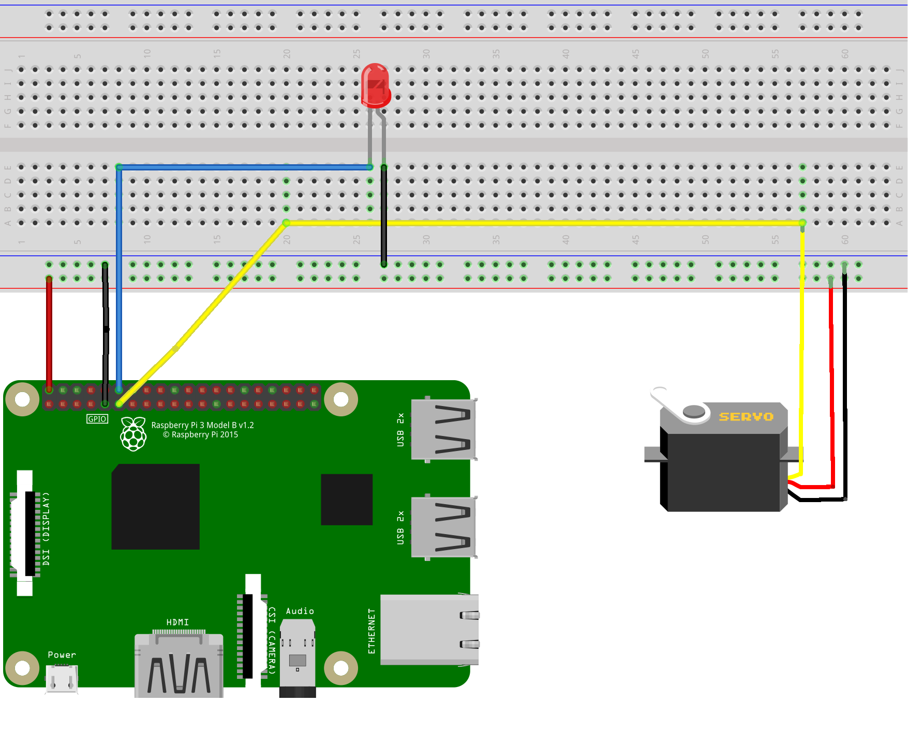
<p> On both client and server sides, After configuring and building zenoh for both devices, you need to run the zenoh daemon in order to make zenoh api calls :</p>

```bash
$ ./zenohd.exe -v -p tcp/192.168.1.5:7447	# 192.168.1.5 is the ip address of one peer(server for exemple).
```
```bash
$ ./zenohd.exe -v -p tcp/192.168.1.6:7447	# 192.168.1.6 is the ip address of the other peer(client for exemple).
```
<p> Our zenoh network is built successfully. Now you need to run your scripts in order to test the control system which works like the following: if a face is being recognized, the raspberry will send a command to the servo to rotate(open a door simulation) and keep opening for 11 seconds. After that, the servo will rotate in the other direction simulating a door close.</p>
<p> Now, lets run the following script at the server side terminal:</p>

```bash
$ python3 zenoh_server_pi.py
```
<p> You should see the following output on your terminal:</p>

```
[*] Please train your model !!!

[*] Creating a Zenoh object(locator=None)

[*] Use Workspace on "/training/" to train the model

[*] Use Workspace on "/recognition/" to recognize images

[*] Declaring Subscriber on '/training/*'...

[*] Declaring Subscriber on '/recognition/*'...

[*] Waiting for a new client to connect...
```
<p> Now the server is waiting for a client to connect in order to train the model for further recognition purposes. On the other raspberry pi, open your terminal and enter the following command to run the script of the client in order to capture images from the raspberry camera and send them to the server to run the training phase of our model :</p>

```bash
$ python3 client_train.py -c 0
```
```
[*] Creating a Zenoh object(locator=None)...

[*] Please enter the camera id and press <return> ==> 1

[*] Sending an image to  /recognition/camera-1

[*] Receiving a recognized image !
```
<p> In the same way, as described in part 1, The program will ask for a unique id for the client, then the raspberry pi will start capturing images from the camera and send it to the server in order to recognize the face available in the pictures, send the result back to the client and signal a servo to rotate if the face is recognized by the system.</p>
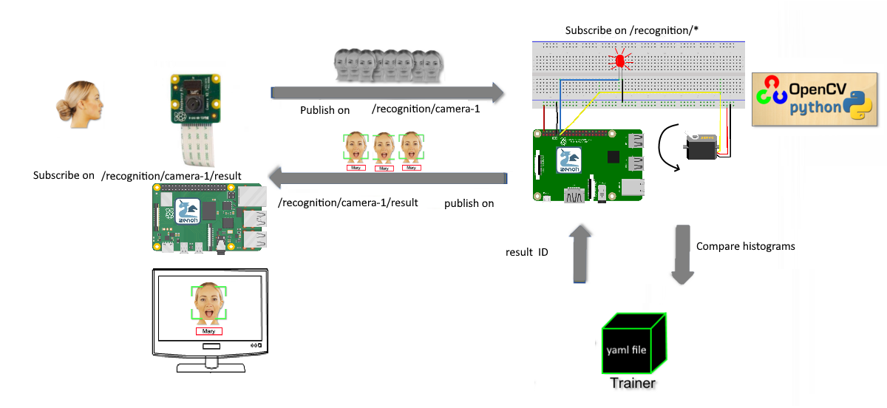


